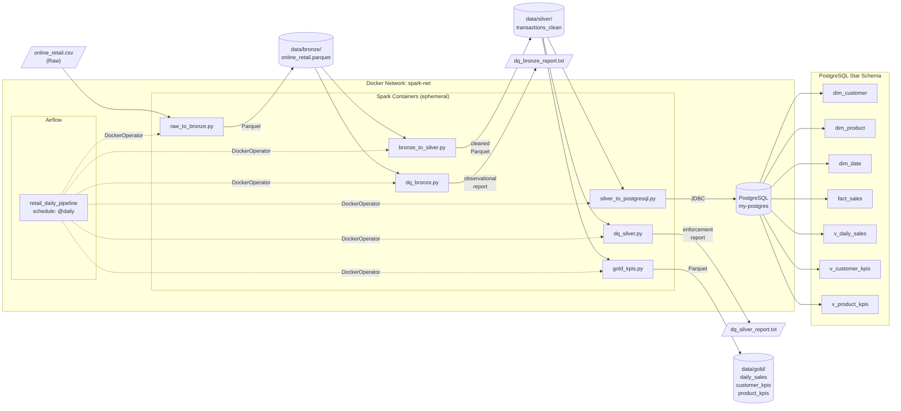

# Pipeline Architecture

## Overview

Online Retail ETL pipeline using the **Medallion Architecture** pattern
(Bronze → Silver → Gold), orchestrated by Apache Airflow on Docker.

## Architecture Diagram



## Task Execution Order

```
raw_to_bronze → dq_bronze → bronze_to_silver → dq_silver → silver_to_postgresql → gold_kpis
```

## Infrastructure

| Component | Container | Image | Port |
|-----------|-----------|-------|------|
| Spark / Jupyter | spark-jupyter | jupyter/pyspark-notebook | 8888 |
| PostgreSQL | my-postgres | postgres | 5432 |
| Airflow | airflow | apache/airflow | 8080 |

All containers run on the `spark-net` Docker network.

## Data Flow Summary

| Layer | Format | Location | Records |
|-------|--------|----------|---------|
| Raw | CSV | data/raw/online_retail.csv | 541,909 |
| Bronze | Parquet | data/bronze/online_retail.parquet | 541,909 |
| Silver | Parquet | data/silver/transactions_clean | 519,607 |
| Gold | Parquet | data/gold/{daily_sales, customer_kpis, product_kpis} | 305 / 4,346 / 4,043 |
| PostgreSQL | Tables | Retail_DB.public.* | Star schema |
